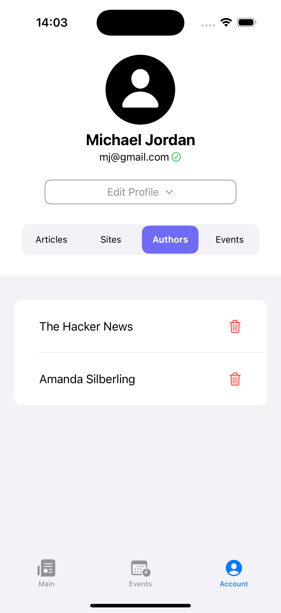

# NewsApp "AboutIT"

This app is a personalized platform for discovering and managing IT industry news and events, customized to match user interests. It uses an external Scraper Module (from a separate repository) to gather and store data in a central database. This data is accessible through an easy-to-use API, enabling dynamic updates within the app. Key features include personalized user preferences, secure data storage, and an AI-powered event parsing system to keep users updated with the latest relevant content.

## Main Functionality
### Core Data Integration
* Comprehensive Data Structure: Core Data setup includes all necessary tables and dependencies, enabling efficient data management and storage.
### API Integration
* Data Flow and Access: API calls enable the transfer of scraped articles into Core Data and retrieval for in-app display, providing a seamless user experience.
### Authentication
* Secure Sign-In and Sign-Up: JWT-based authentication, implemented with **KeychainSwift**, supports secure access to personalized features.
* Sensitive Data Protection: Uses hashed values with added salts to protect user passwords and other sensitive information.

## Extended Functionality
### User Preferences
* Account Page: Displays user preferences, including favorite publishers and authors, with options for easy management and deletion.
* Favorites Management: A dedicated favorites page where users can mark items with hearts, view lists of preferred authors and domains, and use popover menus for quick selection.
* Priority-Based Output: Personalized content suggestions based on user priorities, tailored to show what matters most to each user.
### Notification
* Push Notifications: Custom alerts notify users about new articles and events based on their interests and preferences.
Continuous Content Updates
* Automated Article Fetching: A background method checks every 5 minutes for new articles, keeping content fresh and relevant.
* Content Relevance Analysis: New articles are analyzed and prioritized based on user preferences, ensuring the most relevant content is shown first.

## Event Functionality
### Event Management and Display
* Event Page Design: A dedicated interface for users to explore and manage event details.
* Liked Events: An option to "like" events and delete them from the account page as needed.
* Event Parsing and Storage: AI-driven modules parse event data and store it in a Core Data structure dedicated to events.
* Async Event Requests: Runs asynchronously with article requests to ensure efficient data handling.
* Event Personalization and Calendar Integration: Allows users to save favorite events directly to their personal calendar, providing easy access and reminders for upcoming events.

## AboutIT in Action:

Explore how AboutIT enhances user experiences through its intuitive design and functionality.

### Main Page

Upon launching the app, users are greeted with:

The Main Page consists of two sections:

1. Top Section: Displays the most relevant information, prioritized by time and user preferences.

2. Bottom Section: Features all other articles.

By scrolling down to the  section, users can view additional articles.

### Article Page

Clicking on an article preview opens the detailed view:

Here, logged-in users can save articles by clicking the heart icon in the top corner. They can also save: 

* The .
* The .

### Event Page

Navigating to the Event Page via the bottom tab reveals a custom calendar highlighting upcoming events:

On the Event Page users sees a cutom created calendar with a current date. You can also see upcoming events marked with a purple circle. There's also a list of upcoming events at the bottom of the screen.

Moving on to , where all events of current year will be shown.

Logged-in users can:

Save events as favorites by clicking the plus icon in the top-right corner.
Access event details by selecting an event. 

### Event Details

Detailed event pages provide key information:

* Event name
* Location
* Time
* Price
* Format (in-person/online)
* Description
* Speakers
* Sponsors

Scrolling down allows users to:
Add the event to their calendar.
Visit the event’s website by clicking "Join [event name]."

Here users see the most relevant information about the event such as: name of the event, location, time of the event, price, type(in-person/online) as well as short description, speakers and sponsors.

By scrolling down the users has an opportunity to add this event to his calender or check the events website by clicking "Join [event name]"

### Profile Page

The  is accessible to signed-in users, displaying:
* Personal data
* Saved articles, sites, authors, and events:

Examples include:
* 
* 
* 

If there are no saved items, users will see:

Users can also remove saved items by clicking the icon on the right:

### Profile Editing

Users can update their profile by selecting  Available options include changing personal details such as date of birth and password.

To update their password, users navigate to:

### Authentication Pages

Finally, MyApp features intuitive sign-in and sign-up pages:

* 
* 
* 
